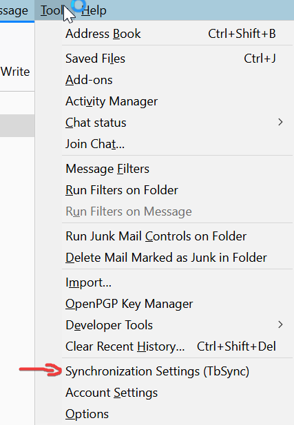
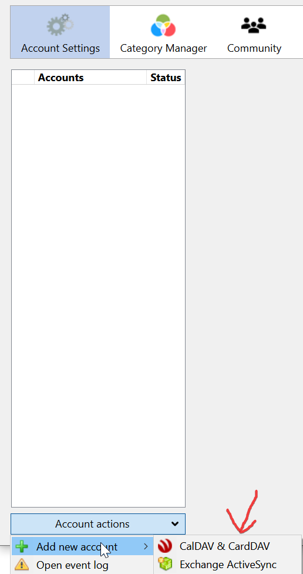
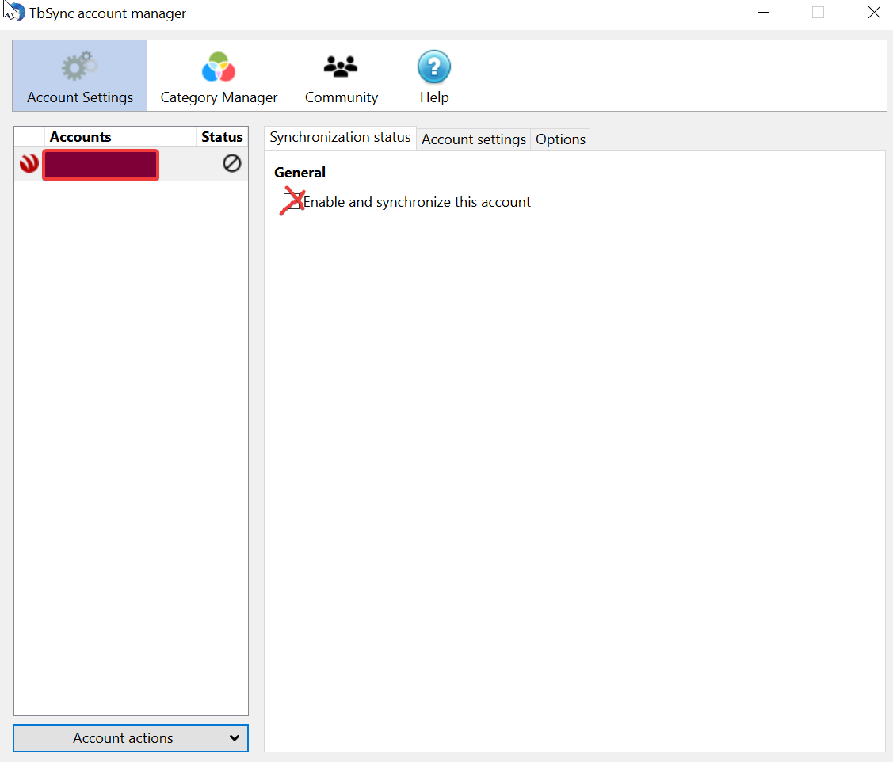

<ol>
<li>
  Launch Thunderbird.
</li>
<li>
  If this is the first time you launched Thunderbird, it asks you whether you would like a new email address. Click <i>Skip this and use my existing email</i> and proceed to step 4.
</li>
<li>
  Go to the <i>Tools</i> menu and select <i>Account Settings</i>.
</li>
<li>
  Click the <i>Account Actions</i> dropdown menu at the bottom left and select <i>Add Mail Account</i>.
</li>
<li>
  Enter your name (<code></code>), email address (<code></code>) and your password. Make sure the <i>Remember password</i> checkbox is selected and click <i>Continue</i>.
</li>
<li>
  Once the configuration has been automatically detected, click <i>Done</i>.
</li>
<li>
  If you already had other accounts configured in Thunderbird, select the new one (<code></code>) on the left, click the <i>Account Actions</i> dropdown and select Set as <i>Default</i>.
</li>
<li>
  Close the account settings window with the <i>OK</i> button.
</li>
<li class="client_connector_enabled">
  In your web browser, download SOGo Connector<a class="client_var_connector_link client_var_link" href="/thunderbird-plugins/sogo-connector-__VERSION__-__DOMAIN__.xpi">SOGo Connector</a>.
</li>
<li class="client_connector_enabled">
  Back in Thunderbird, go to the <i>Tools</i> menu and select <i>Add-ons</i>.
</li>
<li class="client_connector_enabled">
  Click <i>Extensions</i> on the left and ensure that the <i>Lightning</i> add-on is already installed. It is installed by default in the Windows and macOS versions of Thunderbird, but if you are running Linux and installed Thunderbird through your distribution's package manager, <i>Lightning</i> might be available as a separate package (e.g. xul-ext-lightning on Ubuntu).
</li>
<li class="client_connector_enabled">
  Click <i>Extensions</i> on the left, click the little gear icon at the top and select <i>Install Add-on From File</i>. Select the file you downloaded in step 9, click <i>Open</i> and, after waiting for a few seconds, <i>Install Now</i>.
</li>
<li class="client_connector_enabled">
  Click the <i>Restart Now</i> button at the top that appears.
</li>
<li class="client_connector_enabled">
  Thunderbird briefly shows a message that it is updating extensions, then restarts automatically once more.
</li>
<li class="client_connector_enabled">
  When you are prompted to authenticate for <code></code>, enter your email address and password, check <i>Use Password Manager</i> and click <i>OK</i>.
</li>
</ol>

Automatic configuration of calendars and address books in Thunderbird is not currently supported.
      You can ask your server administrator to enable SOGo Connector if you need it.

Automatic configuration of calendars and address books (from step 9 onward) in Thunderbird is only supported if your server administrator has enabled [SOGo Connector](https://mailcow.github.io/mailcow-dockerized-docs/third_party-thunderbird).

## Different method of connecting Cal-/CardDAV in Thunderbird with automatic detection of address books and calendars

Instead of using SOGo Connector you can use a combination of

- https://addons.thunderbird.net/de/thunderbird/addon/tbsync/ and
- https://addons.thunderbird.net/de/thunderbird/addon/dav-4-tbsync/

1. To add your Cal-/CardDAV accounts go to `Tools` and find TbSync

2. You can add new accounts via the CalDAV & CardDAV provider:

3. Choose "Automatic Configuration". Use your mail address as account and username. Use your mail password as DAV password. The server URL is your MAILCOW_HOSTNAME (specifying any protocol is not necessary, just enter the full domain).

4. Now tick the checkbox for "Enable and synchronize this account" in the synchronization status tab:

5. Several available resources should appear in the same window area now. Tick all checkboxes of the resources (address books and calendars) that you want to sync. Choose a synchronization period (in minutes) in the same window area before clicking on "Synchronize now". If you leave the sync at "0" it will only sync manually so choose at least 30 minutes for periodic synchronization.

If you want to manually synchronize you can find this option under "Account actions" - the dropdown-menu where you added the Cal-/CardDAV account (step 2).
