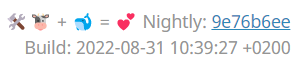

## Automatic update

An update script in your mailcow-dockerized directory will take care of updates.

But use it with caution! If you think you made a lot of changes to the mailcow code, you should use the manual update guide below.

Run the update script:
```
./update.sh
```

If it needs to, it will ask you how you wish to proceed.
Merge errors will be reported.
Some minor conflicts will be auto-corrected (in favour for the mailcow-dockerized repository code).

### Options

```
# Options can be combined

# - Check for updates and show changes
./update.sh --check

# - Do not start mailcow after applying an update
./update.sh --skip-start

# - Skip ICMP Check to public DNS resolvers (Use it only if you´ve blocked any ICMP Connections to your mailcow machine)
./update.sh --skip-ping-check

# - Switch your mailcow updates to the unstable (nightly) branch.
FOR TESTING PURPOSES ONLY!!!! NOT READY FOR PRODUCTION!!!
./update.sh --nightly

# - Switch your mailcow updates to the stable (master) branch. Default unless you changed it with --nightly.
./update.sh --stable

# - Force update (unattended, but unsupported, use at own risk)
./update.sh --force

# - Run garbage collector to cleanup old image tags and exit
./update.sh --gc

# - Update with merge strategy option "ours" instead of "theirs"
#   This will **solve conflicts** when merging in favor for your local changes and should be avoided. Local changes will always be kept, unless we changed file XY, too.
./update.sh --ours

# - Don't update, but prefetch images and exit
./update.sh --prefetch
```

### I forgot what I changed before running update.sh

See `git log --pretty=oneline | grep -i "before update"`, you will have an output similar to this:

```
22cd00b5e28893ef9ddef3c2b5436453cc5223ab Before update on 2020-09-28_19_25_45
dacd4fb9b51e9e1c8a37d84485b92ffaf6c59353 Before update on 2020-08-07_13_31_31
```

Run `git diff 22cd00b5e28893ef9ddef3c2b5436453cc5223ab` to see what changed.

### Can I roll back?

Yes.

See the topic above, instead of a diff, you run checkout:

```
docker compose down
# Replace commit ID 22cd00b5e28893ef9ddef3c2b5436453cc5223ab by your ID
git checkout 22cd00b5e28893ef9ddef3c2b5436453cc5223ab
docker compose pull
docker compose up -d
```

### Hooks

You can hook into the update mechanism by adding scripts called `pre_commit_hook.sh` and `post_commit_hook.sh` to your mailcows root directory. See [this](../manual-guides/u_e-update-hooks.md) for more details.

## Update Cycle

- We schedule a monthly release cycle for a major update at the first tuesday of the month.
- The releases are numbered like this: `YYYY-MM` (e.g. `2022-05`)
- Fixes for a main Update will be stated as "Revisions" like a,b,c (e.g. `2022-05a`, `2022-05b` etc.)

## Update variants

**stable (stable updates)**: These updates are suitable for productive usage. They appear in a cycle of at least 1x per month.

**nightly (unstable updates)**: These updates are **NOT** suitable for production use and are for testing only. The nightly updates are ahead of the stable updates, since in these updates we test newer and more extensive features before they go live for all users.

## NEW: Get Nightly Updates
### Info about the Nightly Updates
Since the 2022-08 update there is the possibility to change the update sources. Until now, the master branch on GitHub served as the only (official) update source. With the August 2022 update, however, there is now the Nightly Branch which contains unstable and major changes for testing and feedback.

The Nightly Branch always gets new updates when something is finished on the mailcow project that will be included in the new main version.

Besides the obvious changes that will be included in the next major update anyway, it also contains exclusive features that need a longer testing time (e.g. the UI update to Bootstrap 5).

### How do I get Nightly Updates?
The process is relatively simple. With the 2022-08 update (assuming an update to the version) it is possible to run `update.sh` with the parameter `--nightly`.

!!! danger
        Please make a backup before or follow the [Best Practice Nightly Update](#best-practice-nightly-update) section before switching to mailcow nightly builds. We are not responsible for any data loss/corruption, so work with caution!

The script will now change the branch with `git checkout nightly`, which means it will ask for the IPv6 settings again. But this is normal.

If everything worked fine (for which we made a backup before) the mailcow UI should now show the current version number and date stamp in the lower right corner:<br>


### Best Practice Nightly Update
!!! info
        We recommend using the Nightly Update only if you have another machine or VM and **NOT** use it productively.

1. use the [cold standby script](../backup_restore/b_n_r-coldstandby.en.md) to copy the machine **before** the switch to the nightly builds on another system.
2. run the `update.sh` script on the new machine with the parameter `--nightly` and confirm.
3. experience/test the nightly updates on the secondary machine.