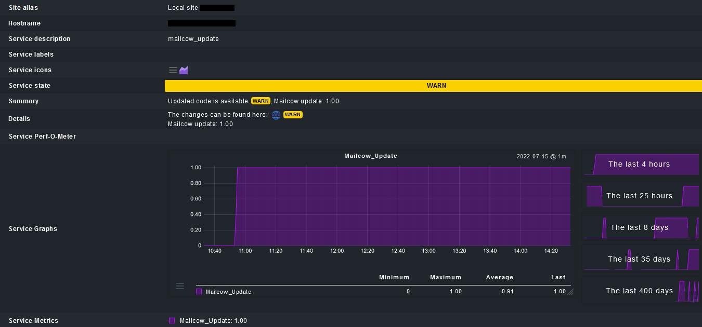

Mailcow bietet mittels dem eigenen Update-Script die Möglichkeit zu prüfen ob Updates vorhanden sind.

Sofern mailcow-Updates mittels checkmk abgefragt werden soll, kann man im `local`-Verzeichnis des checkmk-Agents (normalerweise `/usr/lib/check_mk_agent/local/`) eine ausführbare Datei mit dem Namen `mailcow_update` und nachfolgendem Inhalt erstellen:

````
#!/bin/bash
cd /opt/mailcow-dockerized/ && ./update.sh -c >/dev/null
status=$?
if [ $status -eq 3 ]; then
  echo "0 \"mailcow_update\" mailcow_update=0;1;;0;1 No updates available."
elif [ $status -eq 0 ]; then
  echo "1 \"mailcow_update\" mailcow_update=1;1;;0;1 Updated code is available.\nThe changes can be found here: https://github.com/mailcow/mailcow-dockerized/commits/master"
else
  echo "3 \"mailcow_update\" - Unknown output from update script ..."
fi
exit
````

Sofern das mailcow-Installationsverzeichnis nicht `/opt/` ist, ist das in der 2. Zeile anzupassen.

Danach für euren mailcow-Host in checmk die Services neu inventarisieren und es sollte ein neuer Check mit Namen `mailcow_update` auswählbar sein.

## Screenshots

### Keine Updates verfügbar

Sofern keine Updates vorhanden sind, wird `OK` ausgegeben.


### Neue Updates verfügbar

Sofern Updates vorhanden sind, wird `WARN` ausgegeben.


Sollte stattdessen `CRIT` gewünscht sein, ist die 7. Zeile durch folgendes zu ersetzen:

````
  echo "1 \"mailcow_update\" mailcow_update=1;1;;0;1 Updated code is available.\nThe changes can be found here: https://github.com/mailcow/mailcow-dockerized/commits/master"
````

### Detailierter Check-Output



- Hier wird ein Link zu den GitHub Commits von mailcow ausgegeben, sofern Updates verfügbar sind.
- Metriken werden ebenfalls ausgegeben (nicht nur bei vorhandenen Updates):
  - 0 = Keine Updates verfügbar
  - 1 = Neue Updates verfügbar
