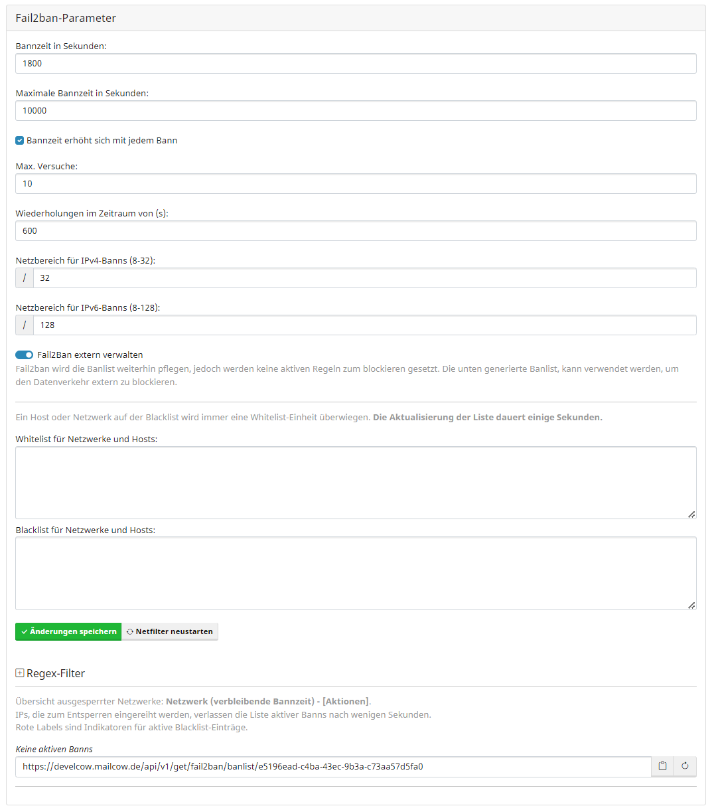

## Netfilter Ban-Einstellungen ändern

Um die Netfilter Ban-Einstellungen zu ändern navigieren Sie zu dem Menü Punkt: `Konfiguration -> Server-Konfiguration -> Konfiguration -> Fail2ban-Parameter`.

Sie sollten dann dieses Fenster sehen:

Hier können Sie verschiedene Optionen für die Banns selbst festlegen. 
Zum Beispiel die max. Ban-Zeit oder die max. Versuche bevor ein Ban ausgeführt wird.

## Netfilter Regex ändern

!!! danger "Achtung"
	Folgender Bereich erfordert zumindest grundlegende Regex kenntnisse.  
	Sollten Sie sich nicht sicher sein, was Sie dort tun, können wir Ihnen nur von der Umkonfiguration abraten.

Sie können neben den Sperreinstellungen ebenfalls definieren, was genau aus den Logs der mailcow Container verwendet werden soll um einen möglichen Angreifer zu sperren.

Dafür müssen Sie das Regex Feld erst einmal aufklappen, was dann in etwa so aussieht:

	
Dort können Sie nun verschiedenste neue Filter-Regeln anlegen.

!!! info "Hinweis"
	Mit weiterschreitenden Updates ist es möglich, dass neue Netfilter Regex Regeln dazu kommen oder entfernt werden.  
	Sollte das der Fall sein empfiehlt es sich mit einem Klick auf `Zurücksetzen auf Standard` die Netfilter Regex Regeln neu laden zu lassen.

## Netfilter Entscheidungen via URL als Quelle für Firewall Blockregeln bereitstellen

!!! info "Hinweis"
	Die Option ist jedoch standardmäßig deaktiviert und muss erst von Ihnen aktiviert werden.

Seit dem 2023-12 Update bietet mailcow die Möglichkeit die Netfilter Entscheidungen als externer Endpoint zu exportieren um die Daten daraus in einem externen Firewall System einbinden zu können, Quasi als Blocklisten Quelle.

??? question "Was bringt mir diese Funktion?"
	Mit dieser Funktionalität können Sie die von Netfilter als gesperrt Markierten IPs an einen Endpunkt weitergeben, welcher diese IPs dann verarbeiten kann. Bspw. eine OPNsense Firewall kann diese Liste dynamisch reinladen.

Schauen wir uns doch mal diese Einstellungen dazu an:

Um die generelle Funktion zu aktivieren muss der Haken bei `Fail2Ban extern verwalten` gesetzt werden.

Sobald dies getan ist kann die URL (Punkt 2) kopiert werden und in den jeweiligen Endpunkt eingesetzt werden.

!!! warning "Wichtig"
	Die URL kann bei bedarf regeneriert werden. Dafür auf das Symbol neben Kopieren `Neuladen Symbol` klicken.