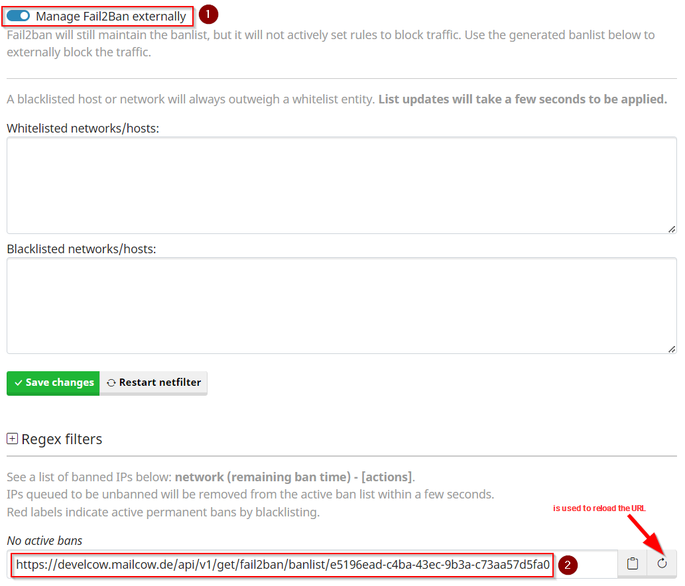

## Change Netfilter Ban Settings

To change the Netfilter settings in general please navigate to: `Configuration -> Configuration & Details -> Configuration -> Fail2ban parameters`.

You should now see a familar interface:

Here you can set several options regarding the bans itself. 
For example the max. Ban time or the max. attempts before a ban is executed.

## Change Netfilter Regex

!!! danger
	The following area requires at least basic regex knowledge.  
	If you are not sure what you are doing there, we can only advise you not to attempt a reconfiguration.

In addition to the ban settings, you can also define what exactly should be used from the mailcow container logs to ban a possible attacker.

To do this, you must first expand the regex field, which will look something like this:

	
There you can now create various new filter rules.

!!! info
	As updates progress, it is possible that new Netfilter regex rules will be added or removed.  
	If this is the case, it is recommended to reset the Netfilter regex rules by clicking on `Reset to default`.

## Provide Netfilter decisions via URL as source for firewall block rules

!!! info
	However, the option is deactivated by default and must first be activated by you.

Since the 2023-12 update, mailcow offers the possibility to export the netfilter decisions as an external endpoint in order to be able to integrate the data from it into an external firewall system, quasi as a blocklist source.

??? question "What does this function do for me?"
	With this functionality, you can forward the IPs marked as blocked by Netfilter to an endpoint, which can then process these IPs. For example, an OPNsense firewall can dynamically load this list.

Let's take a look at these settings:

To activate the general function, the checkbox `Manage Fail2Ban externally` must be checked.

As soon as this is done, the URL (point 2) can be copied and pasted into the respective endpoint.

!!! warning "Important"
	The URL can be regenerated if required. To do this, click on the symbol next to Copy `Reload symbol`.