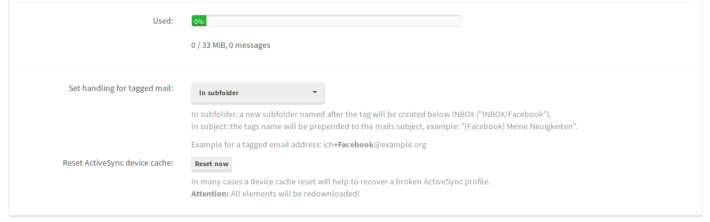

Mailbox-Nutzer können ihre Mailadresse wie in "me+facebook@example.org" markieren. Sie können die Tag-Behandlung im **mailcow UI** Panel (für den Benutzer) unter `Mailbox > Einstellungen` kontrollieren.


*`Sub-Adressierung` (RFC 5233) oder `Plus-Adressierung` auch als Tagging bekannt (nicht zu verwechseln mit [Tags](../mailcow-UI/u_e-mailcow_ui-tags.md))*


### Verfügbare Aktionen

1\. Diese Nachricht in einen Unterordner "facebook" verschieben (wird in Kleinbuchstaben erstellt, falls nicht vorhanden)

2\. Den Tag dem Betreff voranstellen: "[facebook] Betreff"

Bitte beachten Sie: Großgeschriebene Tags werden in Kleinbuchstaben umgewandelt, mit Ausnahme des ersten Buchstabens. Wenn Sie den Tag so lassen wollen, wie er ist, wenden Sie bitte den folgenden Diff an und starten Sie mailcow neu:
```
diff --git a/data/conf/dovecot/global_sieve_after b/data/conf/dovecot/global_sieve_after
index e047136e..933c4137 100644
--- a/data/conf/dovecot/global_sieve_after
+++ b/data/conf/dovecot/global_sieve_after
@@ -15,7 +15,7 @@ if allof (
   envelope :detail :matches "to" "*",
   header :contains "X-Moo-Tag" "YES"
   ) {
-  set :lower :upperfirst "tag" "${1}";
+  set "tag" "${1}";
   if mailboxexists "INBOX/${1}" {
     fileinto "INBOX/${1}";
   } else {
```