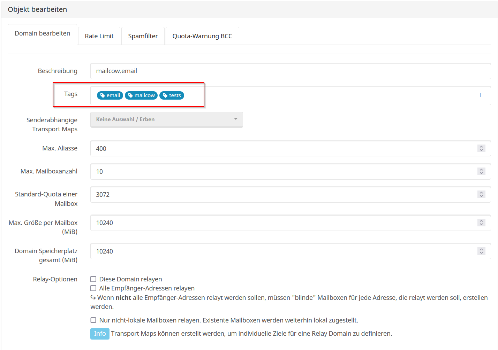

!!! info "Hinweis"
	Um diese Funktion nutzen zu können ist das Update 2022-05 (oder höher) erforderlich! 
	Sollten Sie das Update nicht installiert haben, denken Sie bitte über ein Update nach. 
	Für weitere Informationen bezüglich dem Update Prozess schauen Sie [hier](../../i_u_m/i_u_m_update.md).
	
### Wofür wurden die Tags implementiert?
Mit den Tags ist es deutlich einfacher gezielt nach Domains bzw. Mailboxen zu suchen (wenn diese einen Tag haben).

### Wo lassen sich die Tags finden?
Die Tags befinden sich in der Domain/Mailbox Sektion der mailcow UI.
Um sie zu sehen, klicken Sie einfach auf das kleine Plus-Symbol auf der linken Seite Ihrer Domain/Mailbox (das folgende Bild zeigt das Domain-Ribbon-Menü):

### Wie kann ich ein Tag hinzufügen/entfernen?
Sie können bei der Erstellung einer neuen Domain/eines neuen Postfachs einfach ein Tag hinzufügen/entfernen. Sie können sie auch hinzufügen/entfernen, wenn Sie Ihre gewünschte Domain/Mailbox bearbeiten.

Es sieht ähnlich aus wie hier (das folgende Bild zeigt den Bereich zur Bearbeitung der Domäne):

### Wie kann ich nach einem Tag suchen?
Geben Sie einfach den Tag-Namen in die Suchleiste im Bereich Domain/Postfach ein und warten Sie, bis der Vorgang abgeschlossen ist.

Sie können sogar angeben, ob Sie nur nach Tags suchen möchten.