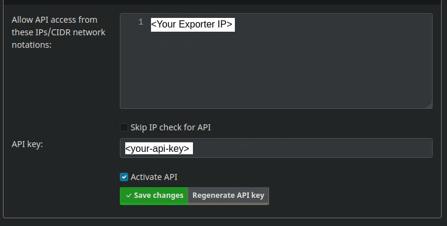
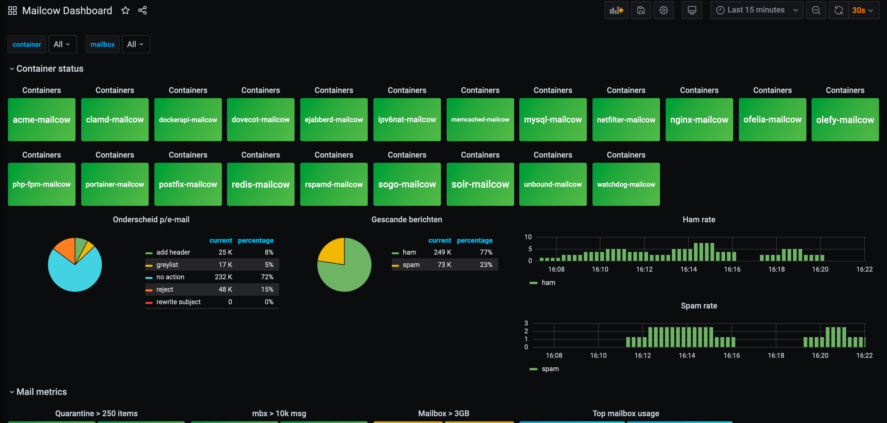

# Prometheus Mailcow Exporter

Um den Prometheus Exporter zu aktivieren.

## Prometheus-exporter-mailcow Dienst
### Einrichtung 

Zuerst müssen Sie diese Datei einrichten:

```

# Kopiere die Override-Datei hinter der Mailcow-Compose-Datei
cp your-mailcow-project-path/helper-scripts/docker-compose.override.yml.d/PROMETHEUS_EXPORTER/docker-compose.override.yml your-mailcow-project-path/

# Starte die Compose-Datei erneut
docker compose up -d

```

[Prometheus](https://prometheus.io) Exporter für Informationen über eine Mailcow-Instanz.

### Nutzung

Der Endpunkt `/metrics` benötigt die URL-Parameter `host` und `apiKey`. `host` ist der Hostname Ihrer Mailcow-Instanz. `apiKey` sollte ein schreibgeschützter API-Schlüssel sein, der im Mailcow-Management-Interface unter 'Access > API' generiert werden kann.




**ImpoWichtigrtant:** Beschränken Sie den Zugriff auf den Exporter und schützen Sie Ihren API-Schlüssel!

---
## Prometheus Konfiguration

Die folgende Prometheus-Konfiguration kann verwendet werden, um diese Informationen an den Endpunkt zu übertragen:

```yaml
scrape_configs:
  - job_name: 'mailcow'
    static_configs:
      - targets: [ 'mailcow_exporter:9099' ]
    params:
      MAILCOW_EXPORTER_HOST: [ 'mail.example.com' ]
      MAILCOW_EXPORTER_API_KEY: [ 'YOUR-APIKEY-HERE' ]
      MAILCOW_EXPORTER_TOKEN: [ 'YOUR-APIKEY-HERE' ] # if you MAILCOW_EXPORTER_TOKEN_DISABLE=false
```

Es unterstützt auch einen optionalen `scheme` URL Parameter, der standardmäßig auf `https` gesetzt ist. Falls Sie auf die API ohne TLS-Verschlüsselung zugreifen möchten, setzen Sie ihn auf `http`.

### Setzen des Hosts oder API-Schlüssels beim Starten der Anwendung

Falls der Exporter für eine einzelne Mailcow-Instanz verwendet wird, kann es sinnvoll sein, `host` und `apiKey` nicht mit jeder Anfrage zu senden, da sie sich nicht ändern.

Daher können der API-Schlüssel oder der Host beim Starten der Anwendung mit Flags oder Umgebungsvariablen gesetzt werden.

Der Host kann mit dem Flag `host` oder der Umgebungsvariable `MAILCOW_EXPORTER_HOST` gesetzt werden. Falls beide gesetzt sind, hat das Flag Vorrang.

Der API-Schlüssel kann mit dem Flag `apikey` oder der Umgebungsvariable `MAILCOW_EXPORTER_API_KEY` gesetzt werden. Falls beide gesetzt sind, hat das Flag Vorrang.

**HINWEIS**: In diesem Fall ist es empfehlenswert, den Zugriff auf den Exporter über localhost zu beschränken (setzen Sie das `listen` Flag auf `127.0.0.1:9099` oder `::1:9099`) oder den Zugriff auf ein lokales Netzwerk zu beschränken, anstatt den Port auf allen Schnittstellen zu binden.


### Beispielmetriken

```
HELP mailcow_api_response_size Size of API response in bytes
TYPE mailcow_api_response_size gauge
mailcow_api_response_size{endpoint="api/v1/get/domain/all",host="mail.example.com",statusCode="200"} 2198
mailcow_api_response_size{endpoint="api/v1/get/logs/rspamd-stats",host="mail.example.com",statusCode="200"} 1950
mailcow_api_response_size{endpoint="api/v1/get/mailbox/all",host="mail.example.com",statusCode="200"} 50554
mailcow_api_response_size{endpoint="api/v1/get/mailq/all",host="mail.example.com",statusCode="200"} 2
mailcow_api_response_size{endpoint="api/v1/get/quarantine/all",host="mail.example.com",statusCode="200"} 2
mailcow_api_response_size{endpoint="api/v1/get/status/containers",host="mail.example.com",statusCode="200"} 2813
HELP mailcow_api_response_time Response time of the API in milliseconds (1/1000s of a second)
TYPE mailcow_api_response_time gauge
mailcow_api_response_time{endpoint="api/v1/get/domain/all",host="mail.example.com",statusCode="200"} 46
mailcow_api_response_time{endpoint="api/v1/get/logs/rspamd-stats",host="mail.example.com",statusCode="200"} 116
mailcow_api_response_time{endpoint="api/v1/get/mailbox/all",host="mail.example.com",statusCode="200"} 390
mailcow_api_response_time{endpoint="api/v1/get/mailq/all",host="mail.example.com",statusCode="200"} 337
mailcow_api_response_time{endpoint="api/v1/get/quarantine/all",host="mail.example.com",statusCode="200"} 31
mailcow_api_response_time{endpoint="api/v1/get/status/containers",host="mail.example.com",statusCode="200"} 139
HELP mailcow_api_success 1, if request was sucessful, 0 if not
TYPE mailcow_api_success gauge
mailcow_api_success{endpoint="api/v1/get/domain/all",host="mail.example.com"} 1
mailcow_api_success{endpoint="api/v1/get/logs/rspamd-stats",host="mail.example.com"} 1
mailcow_api_success{endpoint="api/v1/get/mailbox/all",host="mail.example.com"} 1
mailcow_api_success{endpoint="api/v1/get/mailq/all",host="mail.example.com"} 1
mailcow_api_success{endpoint="api/v1/get/quarantine/all",host="mail.example.com"} 1
mailcow_api_success{endpoint="api/v1/get/status/containers",host="mail.example.com"} 1
HELP mailcow_container_running 1 if the container is running, 0 if not
TYPE mailcow_container_running gauge
mailcow_container_running{container="acme-mailcow",host="mail.example.com",image="mailcow/acme:1.90"} 1
mailcow_container_running{container="clamd-mailcow",host="mail.example.com",image="mailcow/clamd:1.66"} 1
mailcow_container_running{container="dockerapi-mailcow",host="mail.example.com",image="mailcow/dockerapi:2.09"} 1
mailcow_container_running{container="dovecot-mailcow",host="mail.example.com",image="mailcow/dovecot:2.2"} 1
mailcow_container_running{container="memcached-mailcow",host="mail.example.com",image="memcached:alpine"} 1
mailcow_container_running{container="mysql-mailcow",host="mail.example.com",image="mariadb:10.5"} 1
mailcow_container_running{container="netfilter-mailcow",host="mail.example.com",image="mailcow/netfilter:1.59"} 1
mailcow_container_running{container="nginx-mailcow",host="mail.example.com",image="nginx:mainline-alpine"} 1
mailcow_container_running{container="ofelia-mailcow",host="mail.example.com",image="mcuadros/ofelia:latest"} 1
mailcow_container_running{container="olefy-mailcow",host="mail.example.com",image="mailcow/olefy:1.13"} 1
mailcow_container_running{container="php-fpm-mailcow",host="mail.example.com",image="mailcow/phpfpm:1.91.1"} 1
mailcow_container_running{container="postfix-mailcow",host="mail.example.com",image="mailcow/postfix:1.77"} 1
mailcow_container_running{container="redis-mailcow",host="mail.example.com",image="redis:7-alpine"} 1
mailcow_container_running{container="rspamd-mailcow",host="mail.example.com",image="mailcow/rspamd:1.98"} 1
mailcow_container_running{container="sogo-mailcow",host="mail.example.com",image="mailcow/sogo:1.127.1"} 1
mailcow_container_running{container="solr-mailcow",host="mail.example.com",image="mailcow/solr:1.8.3"} 1
mailcow_container_running{container="unbound-mailcow",host="mail.example.com",image="mailcow/unbound:1.23"} 1
mailcow_container_running{container="watchdog-mailcow",host="mail.example.com",image="mailcow/watchdog:2.05"} 1
HELP mailcow_container_start Unix timestamp of the container start
TYPE mailcow_container_start gauge
mailcow_container_start{container="acme-mailcow",host="mail.example.com",image="mailcow/acme:1.90"} 1.738153225e+09
mailcow_container_start{container="clamd-mailcow",host="mail.example.com",image="mailcow/clamd:1.66"} 1.738153225e+09
mailcow_container_start{container="dockerapi-mailcow",host="mail.example.com",image="mailcow/dockerapi:2.09"} 1.738153193e+09
mailcow_container_start{container="dovecot-mailcow",host="mail.example.com",image="mailcow/dovecot:2.2"} 1.738585341e+09
mailcow_container_start{container="memcached-mailcow",host="mail.example.com",image="memcached:alpine"} 1.738153194e+09
mailcow_container_start{container="mysql-mailcow",host="mail.example.com",image="mariadb:10.5"} 1.738153194e+09
mailcow_container_start{container="netfilter-mailcow",host="mail.example.com",image="mailcow/netfilter:1.59"} 1.738558297e+09
mailcow_container_start{container="nginx-mailcow",host="mail.example.com",image="nginx:mainline-alpine"} 1.738153234e+09
mailcow_container_start{container="ofelia-mailcow",host="mail.example.com",image="mcuadros/ofelia:latest"} 1.738153196e+09
mailcow_container_start{container="olefy-mailcow",host="mail.example.com",image="mailcow/olefy:1.13"} 1.738153194e+09
mailcow_container_start{container="php-fpm-mailcow",host="mail.example.com",image="mailcow/phpfpm:1.91.1"} 1.738153195e+09
mailcow_container_start{container="postfix-mailcow",host="mail.example.com",image="mailcow/postfix:1.77"} 1.739367303e+09
mailcow_container_start{container="redis-mailcow",host="mail.example.com",image="redis:7-alpine"} 1.738153194e+09
mailcow_container_start{container="rspamd-mailcow",host="mail.example.com",image="mailcow/rspamd:1.98"} 1.739276409e+09
mailcow_container_start{container="sogo-mailcow",host="mail.example.com",image="mailcow/sogo:1.127.1"} 1.73856954e+09
mailcow_container_start{container="solr-mailcow",host="mail.example.com",image="mailcow/solr:1.8.3"} 1.738153194e+09
mailcow_container_start{container="unbound-mailcow",host="mail.example.com",image="mailcow/unbound:1.23"} 1.739367003e+09
mailcow_container_start{container="watchdog-mailcow",host="mail.example.com",image="mailcow/watchdog:2.05"} 1.738153226e+09
HELP mailcow_domain_active Active flag for this domain
TYPE mailcow_domain_active gauge
mailcow_domain_active{domain="example.com",host="mail.example.com"} 1
mailcow_domain_active{domain="parstelekom.ir",host="mail.example.com"} 1
HELP mailcow_domain_aliases Current aliases count for the domain
TYPE mailcow_domain_aliases gauge
mailcow_domain_aliases{domain="example.com",host="mail.example.com"} 0
mailcow_domain_aliases{domain="parstelekom.ir",host="mail.example.com"} 0
HELP mailcow_domain_mailboxes Current mailboxes count for the domain
TYPE mailcow_domain_mailboxes gauge
mailcow_domain_mailboxes{domain="example.com",host="mail.example.com"} 34
mailcow_domain_mailboxes{domain="parstelekom.ir",host="mail.example.com"} 5
HELP mailcow_domain_max_aliases Maximum amount of aliases for the domain
TYPE mailcow_domain_max_aliases gauge
mailcow_domain_max_aliases{domain="example.com",host="mail.example.com"} 400
mailcow_domain_max_aliases{domain="parstelekom.ir",host="mail.example.com"} 400
HELP mailcow_domain_max_mailboxes Maximum amount of mailboxes for the domain
TYPE mailcow_domain_max_mailboxes gauge
mailcow_domain_max_mailboxes{domain="example.com",host="mail.example.com"} 50
mailcow_domain_max_mailboxes{domain="parstelekom.ir",host="mail.example.com"} 10
HELP mailcow_domain_messages Number of messages in for the domain mailboxes
TYPE mailcow_domain_messages gauge
mailcow_domain_messages{domain="example.com",host="mail.example.com"} 1819
mailcow_domain_messages{domain="parstelekom.ir",host="mail.example.com"} 31
HELP mailcow_domain_quota_allowed Aggregate quota maximum for the domain in bytes
TYPE mailcow_domain_quota_allowed gauge
mailcow_domain_quota_allowed{domain="example.com",host="mail.example.com"} 1.073741824e+10
mailcow_domain_quota_allowed{domain="parstelekom.ir",host="mail.example.com"} 1.073741824e+10
HELP mailcow_domain_quota_used Current size of the domain in bytes
TYPE mailcow_domain_quota_used gauge
mailcow_domain_quota_used{domain="example.com",host="mail.example.com"} 1.441691634e+09
mailcow_domain_quota_used{domain="parstelekom.ir",host="mail.example.com"} 5.14462e+06
HELP mailcow_exporter_success 
TYPE mailcow_exporter_success gauge
mailcow_exporter_success{host="mail.example.com",provider="provider.Container"} 1
mailcow_exporter_success{host="mail.example.com",provider="provider.Domain"} 1
mailcow_exporter_success{host="mail.example.com",provider="provider.Mailbox"} 1
mailcow_exporter_success{host="mail.example.com",provider="provider.Mailq"} 1
mailcow_exporter_success{host="mail.example.com",provider="provider.Quarantine"} 1
mailcow_exporter_success{host="mail.example.com",provider="provider.Rspamd"} 1
HELP mailcow_mailbox_last_login Timestamp of the last IMAP login for this mailbox
TYPE mailcow_mailbox_last_login gauge
mailcow_mailbox_last_login{host="mail.example.com",mailbox="s.hassanzadeh@example.com"} 1.738768754e+09
mailcow_mailbox_last_login{host="mail.example.com",mailbox="r.sabouri@example.com"} 1.738760902e+09
mailcow_mailbox_last_login{host="mail.example.com",mailbox="test@example.com"} 1.739254299e+09
HELP mailcow_mailbox_messages Number of messages in the mailbox
TYPE mailcow_mailbox_messages gauge
mailcow_mailbox_messages{host="mail.example.com",mailbox="s.hassanzadeh@example.com"} 1
mailcow_mailbox_messages{host="mail.example.com",mailbox="r.sabouri@example.com"} 1
mailcow_mailbox_messages{host="mail.example.com",mailbox="test@example.com"} 28
HELP mailcow_mailbox_quota_allowed Quota maximum for the mailbox in bytes
TYPE mailcow_mailbox_quota_allowed gauge
mailcow_mailbox_quota_allowed{host="mail.example.com",mailbox="s.hassanzadeh@example.com"} 0
mailcow_mailbox_quota_allowed{host="mail.example.com",mailbox="r.sabouri@example.com"} 0
mailcow_mailbox_quota_allowed{host="mail.example.com",mailbox="test@example.com"} 0
HELP mailcow_mailbox_quota_used Current syze of the mailbox in bytes
TYPE mailcow_mailbox_quota_used gauge
mailcow_mailbox_quota_used{host="mail.example.com",mailbox="s.hassanzadeh@example.com"} 2009
mailcow_mailbox_quota_used{host="mail.example.com",mailbox="r.sabouri@example.com"} 2033
HELP mailcow_rspamd_action Number of items for which a certain action has been taken
TYPE mailcow_rspamd_action gauge
mailcow_rspamd_action{action="add header",host="mail.example.com"} 4
mailcow_rspamd_action{action="greylist",host="mail.example.com"} 15
mailcow_rspamd_action{action="no action",host="mail.example.com"} 2159
mailcow_rspamd_action{action="reject",host="mail.example.com"} 19
mailcow_rspamd_action{action="rewrite subject",host="mail.example.com"} 0
mailcow_rspamd_action{action="soft reject",host="mail.example.com"} 0
HELP mailcow_rspamd_bytes_allocated 
TYPE mailcow_rspamd_bytes_allocated gauge
mailcow_rspamd_bytes_allocated{host="mail.example.com"} 3.1404536e+07
HELP mailcow_rspamd_chunks 
TYPE mailcow_rspamd_chunks gauge
mailcow_rspamd_chunks{host="mail.example.com",state="allocated"} 325
mailcow_rspamd_chunks{host="mail.example.com",state="freed"} 0
mailcow_rspamd_chunks{host="mail.example.com",state="oversized"} 1731
mailcow_rspamd_chunks{host="mail.example.com",state="shared"} 3
HELP mailcow_rspamd_classification 
TYPE mailcow_rspamd_classification gauge
mailcow_rspamd_classification{classification="ham",host="mail.example.com"} 2174
mailcow_rspamd_classification{classification="spam",host="mail.example.com"} 23
HELP mailcow_rspamd_connections 
TYPE mailcow_rspamd_connections gauge
mailcow_rspamd_connections{host="mail.example.com"} 76
HELP mailcow_rspamd_control_connections 
TYPE mailcow_rspamd_control_connections gauge
mailcow_rspamd_control_connections{host="mail.example.com"} 2280
HELP mailcow_rspamd_fragmented 
TYPE mailcow_rspamd_fragmented gauge
mailcow_rspamd_fragmented{host="mail.example.com"} 0
HELP mailcow_rspamd_fuzzy_hashes 
TYPE mailcow_rspamd_fuzzy_hashes gauge
mailcow_rspamd_fuzzy_hashes{action="local",host="mail.example.com"} 1
mailcow_rspamd_fuzzy_hashes{action="mailcow",host="mail.example.com"} 1.7192912e+07
mailcow_rspamd_fuzzy_hashes{action="rspamd.com",host="mail.example.com"} 1.0903119062e+10
HELP mailcow_rspamd_learned 
TYPE mailcow_rspamd_learned gauge
mailcow_rspamd_learned{host="mail.example.com"} 33
HELP mailcow_rspamd_pools 
TYPE mailcow_rspamd_pools gauge
mailcow_rspamd_pools{host="mail.example.com",state="allocated"} 10893
mailcow_rspamd_pools{host="mail.example.com",state="freed"} 10844
HELP mailcow_rspamd_scanned 
TYPE mailcow_rspamd_scanned gauge
mailcow_rspamd_scanned{host="mail.example.com"} 2197
```

## Grafana Dashboard

[Grafana](https://grafana.com/) Die offene und anpassbare Observability-Plattform."

Ein Screenshot, der zeigt, wie das Dashboard aussieht:

Dieses Dashboard wurde von [remkolodder/mailcow-dashboard](https://github.com/remkolodder/mailcow-dashboard) adaptiert, erstellt von [Remko Lodder].

## Repository

Dieses Repository enthält den Quellcode für den Exporter, ein Dockerfile zur Erstellung des Images und Beispiel-Grafana-Dashboards.

[https://github.com/mailcow/prometheus-exporter](https://github.com/mailcow/prometheus-exporter)

