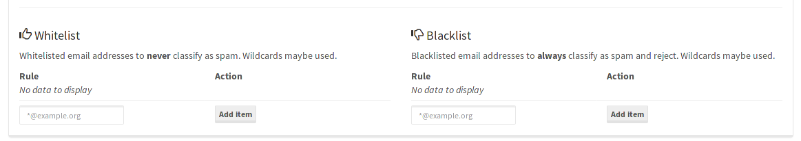

To add or edit an entry to your **domain wide** filter table, login to your *mailcow UI* as (domain) administrator.

!!! info
    Be aware that a user [may override](u_e-mailcow_ui-spamfilter.md) this setting by setting his own black- and whitelist!

There is also a global filter table in /admin to configure a server-wide filter for multiple Regex maps (Todo: Screenshots). 
