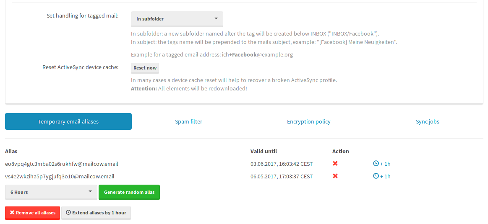

These temporary email aliases are mostly used for places where we need to provide an email address but don't want future correspondence with. They are also called spam alias.

To create, delete or extend a temporary email aliases you need to login to mailcow's UI as a mailbox user and navigate to the tab **Temporary email aliases**:

